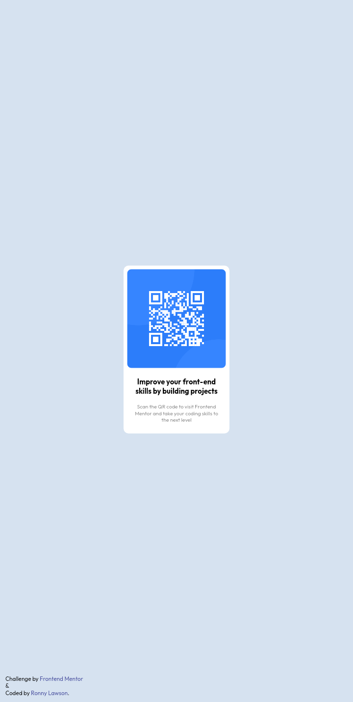

# Frontend Mentor - QR Code Component Solution

This is my solution to the [QR code component challenge on Frontend Mentor](https://www.frontendmentor.io/challenges/qr-code-component-iux_sIO_H). These challenges are great for improving coding skills by working on real-life projects.

## Table of contents

- [Overview](#overview)
  - [Screenshot](#screenshot)
  - [Links](#links)
  - [Built with](#built-with)
  - [What I learned](#what-i-learned)
  - [Continued development](#continued-development)
  - [Useful resources](#useful-resources)
- [Author](#author)
- [Acknowledgments](#acknowledgments)

## Overview

### Screenshot




Here is screenshot of the final product.

### Links

- Solution URL: [My solution](https://your-solution-url.com)
- Live Site URL: [Live site](https://your-live-site-url.com)

### Built with

- Semantic HTML5 markup
- CSS3 custom properties
- Flexbox layout
- Mobile-first workflow

### What I learned

This project allowed me to practice key concepts like responsive design and using Flexbox for layout. Here is an example of some code I'm particularly proud of:

```css
.container {
  display: flex;
  justify-content: center;
  align-items: center;
}
```

This helped center the QR code component perfectly in the middle of the screen, regardless of screen size.

### Continued development

I plan to continue improving my understanding of responsive design and exploring advanced CSS layout techniques like CSS Grid.

### Useful resources

- [CSS-Tricks Flexbox Guide](https://css-tricks.com/snippets/css/a-guide-to-flexbox/) - This article was invaluable in helping me master Flexbox for this project.
- [MDN Web Docs](https://developer.mozilla.org/) - A great reference for HTML and CSS best practices.

## Author
- Frontend Mentor - [@ronnylawsons](https://www.frontendmentor.io/profile/ronnylawsons)
- Telegram - [@Ronny_Lawson07](https://www.t.me/Ronny_Lawson07)

## Acknowledgments

Thanks to Frontend Mentor for the challenge and to [CSS-Tricks](https://css-tricks.com/) for the useful resources. 

